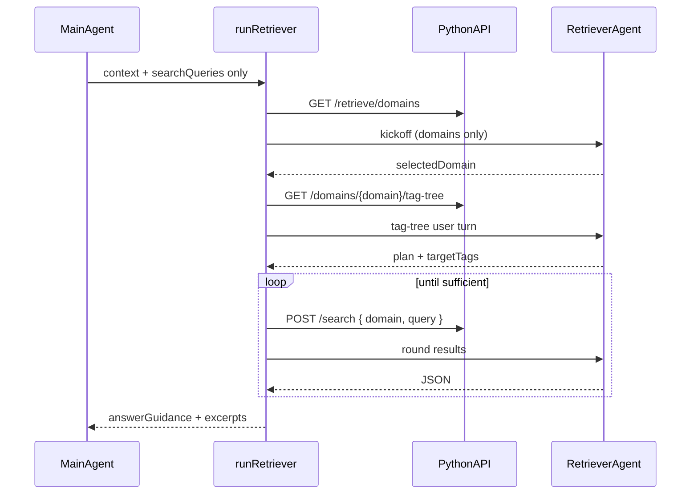

# agent-ai

TypeScript gateway for Hello-Wiki: **all LLM calls and context management** (main Agent chat, extract, init-tags, Retriever orchestration, JSONL sessions). Default HTTP port `8766`.

**Not in this package**: Wiki file APIs or PostgreSQL—those live in `apps/backend` (Python). Python may call this service over HTTP; do not add DB access here.

## 主 Agent / Retriever 隔离原则

**主 Agent `retrieve` 工具不得携带**（PR 若加回视为架构回归）：

- `domain`、`tagTree`、`targetTags`、`pageId`、表名、SQL、ltree 路径等数据库结构信息

**仅 Retriever + Python 编排**可访问工作区目录；主 Agent 只接收 tool 文本中的 `answerGuidance` 与引用摘要，`details` 仅含 `{ sufficient, excerptCount }`。

**例外**：`init_tags` 仍需要 `domain`（显式建库/初始化，非用户问答检索）。

实现约束见 [`src/agent/tools/registry.ts`](src/agent/tools/registry.ts) 文件头注释。

## Prompt sources (two layers)

| Layer | Location | Loader | Purpose |
|-------|----------|--------|---------|
| **User skills** | `apps/skills/` | `src/ingest/skill-loader.ts` | Domain prompts users can customize (e.g. `knowledge-extraction`, `tag-initialize`) |
| **Built-in templates** | `packages/agent-ai/prompts/` | `src/utils/prompt-loader.ts` | Fixed operational prompts (main agent, Retriever) |

## Retrieve flow (Retriever Agent)



1. **Main Agent** calls `retrieve` with `contextSummary`, `questionRestatement`, `searchQueries` only.
2. **Orchestrator** loads domains via `GET /api/v1/retrieve/domains`.
3. **Retriever** kickoff LLM → `selectedDomain` (no tag tree yet).
4. **Orchestrator** loads `GET /api/v1/retrieve/domains/{domain}/tag-tree`.
5. **Second LLM** round with tag tree → revised `nextSearchQueries` / `targetTags`.
6. **Loop**: `POST /api/v1/retrieve/search` (body includes `domain`) → round user message → until `sufficient`.

Tag paths use `foo.bar` form; `domain` is sent separately in search body (not as ltree prefix).

### Dev: Retriever session trace

`runRetriever` returns `sessionRounds` in the API response. Traces append to **`packages/agent-ai/data/retriever-sessions/{sessionId}.jsonl`** (override with `AGENT_AI_RETRIEVER_SESSION_DIR`): `retrieveTrace` lines per phase (`start`, `domains`, `llm_kickoff`, `tag_tree`, `search_round`, `llm_round`, `complete`) plus a final `toolResult` (`toolName: "retrieve"`). Main Agent chat stays in `data/agent-sessions/` (`AGENT_AI_SESSION_DIR`). The `retrieve` tool passes the chat `sessionId` so both logs share the same id but different directories.

## Layout

```
prompts/           # index.yaml + *.md
src/
  agent/           # main Agent loop + tools
  retrieve/
    agent.ts
    loop.ts
    retriever-messages.ts
    retrieve-context-client.ts
    search-client.ts
    insight-client.ts
  ingest/
  utils/
  server.ts
```

## Commands

```bash
pnpm --filter agent-ai build
pnpm --filter agent-ai serve
pnpm check:agent-ai
```

Default workspace for Python retrieve: `00000000-0000-0000-0000-000000000001` (`AGENT_AI_WORKSPACE_ID`).
